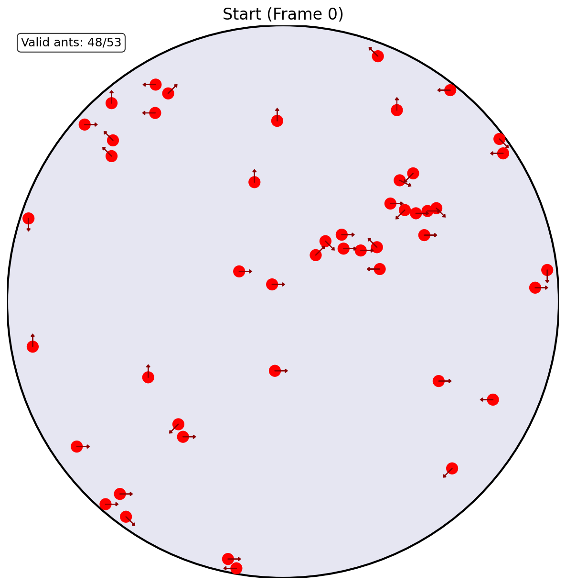

# Real Data Conversion and Visualization Guide

This guide explains how to use the real ant data conversion and visualization tools.

## Overview

The system consists of two main scripts:
1. **`convert_real_to_sim.py`** - Converts real ant tracking data to simulation format
2. **`visualise_converted.py`** - Creates visualizations from converted data

## Prerequisites

- Python with required packages: `numpy`, `pandas`, `matplotlib`, `pickle`
- Real ant data file (`.pkl` format)

## Directory Structure

```
realdata/
├── convert_real_to_sim.py      # Data conversion script
├── visualise_converted.py     # Visualization script
├── visualise_real.py          # Original visualization (legacy)
├── how_to_use.md              # This guide
├── real2sim_data/             # Output directory for converted data (gitignored)
│   ├── positions.pkl          # Converted position data
│   ├── directions.pkl         # Calculated direction data
│   └── metadata.pkl           # Transformation metadata
└── visualize/                 # Output directory for images
    ├── snapshot_01_start.png
    ├── snapshot_02_middle.png
    └── snapshot_03_end.png
```

## Step 1: Data Conversion

### Purpose
Converts raw ant tracking data to arena-compatible format with proper coordinate transformation and direction calculation.

### Usage
```bash
cd realdata
python convert_real_to_sim.py
```

### What it does:
1. **Loads real data** from `../../ant-info/maruyama_data/KC048_10cm_5h_20230610_1h-2h.pkl`
2. **Analyzes coordinate ranges** (e.g., X: 42-1231, Y: 64-1244)
3. **Transforms coordinates** to arena space (-400 to +400)
4. **Calculates directions** using moving average of x,y coordinates (window size: 5 frames)
5. **Handles missing data** (NaN values) appropriately
6. **Saves converted data** to `real2sim_data/` directory

### Output files:
- **`positions.pkl`** - 3D array (frames, ants, xy_coordinates)
- **`directions.pkl`** - 2D array (frames, ants)
- **`metadata.pkl`** - Dictionary with transformation parameters

### Expected output:
```
Data shape: (216001, 106)
Number of ants: 53
Number of frames: 216001
X coordinate range: 42.00 to 1231.00
Y coordinate range: 64.00 to 1244.00
Data center: (636.50, 654.00)
Max span: 1189.00
Converting coordinates and calculating directions...
Processing ant 1/53...
...
Conversion complete! Data saved to real2sim_data/
```

## Step 2: Visualization

### Purpose
Creates snapshot visualizations from converted data to verify proper transformation.

### Usage
```bash
cd realdata
python visualise_converted.py
```

### What it does:
1. **Loads converted data** from `real2sim_data/`
2. **Selects 3 time points**: Start (frame 0), Middle, End
3. **Creates visualizations** with:
   - Arena boundary (circular, radius 400)
   - Ant positions (red circles)
   - Direction indicators (red arrows)
   - Statistics overlay
4. **Saves images** to `visualize/` directory

### Output files:
- **`snapshot_01_start.png`** - Visualization at frame 0
- **`snapshot_02_middle.png`** - Visualization at middle frame
- **`snapshot_03_end.png`** - Visualization at final frame

### Expected output:
```
Loading converted data from real2sim_data...
Loaded data:
- Positions shape: (216001, 53, 2)
- Directions shape: (216001, 53)
- Number of ants: 53
- Number of frames: 216001
- Arena radius: 400.0
Creating snapshots at frames: [0, 108000, 216000]
...
Visualization complete! Snapshots saved to visualize/

=== Data Summary ===
Start (Frame 0):
  Valid ants: 48/53
  Average distance from center: 274.9
  Max distance from center: 392.4
```

### Example Visualization
Below is an example of the generated visualization showing ants (red circles) with direction indicators (red arrows) within the arena boundary:



*Example snapshot showing 48 ants positioned within the circular arena (radius 400). Each red circle represents an ant, and the red arrows indicate the calculated movement direction based on moving average.*

## Configuration Options

### Modifying input data file
Edit `convert_real_to_sim.py`, line 145:
```python
data_file = "../../ant-info/maruyama_data/YOUR_DATA_FILE.pkl"
```

### Changing arena size
Edit `convert_real_to_sim.py`, line 73:
```python
arena_radius = 400.0  # Change this value
```

### Adjusting direction calculation
Edit `convert_real_to_sim.py`, line 7:
```python
def calculate_moving_average_direction(x_coords, y_coords, window_size=5):
```
Change `window_size` for different smoothing levels.

### Modifying visualization parameters
Edit `visualise_converted.py`:
- **Ant size**: Line 64: `ant_body = plt.Circle((x, y), 8, color='red', zorder=2)`
- **Arrow length**: Line 67: `arrow_length = 15`
- **Image resolution**: Line 108: `fig.savefig(output_file, dpi=150, ...)`

## Data Format Details

### Input Data Format
- **Pandas DataFrame** with shape (frames, ant_columns)
- **Column structure**: [ant1_x, ant1_y, ant2_x, ant2_y, ...]
- **Missing data**: NaN values for untracked positions

### Output Data Format

#### positions.pkl
```python
# Shape: (num_frames, num_ants, 2)
# positions[frame_idx, ant_idx, 0] = x_coordinate
# positions[frame_idx, ant_idx, 1] = y_coordinate
# Coordinate range: approximately -400 to +400
```

#### directions.pkl
```python
# Shape: (num_frames, num_ants)
# directions[frame_idx, ant_idx] = angle_in_radians
# Range: -π to +π (standard atan2 output)
```

#### metadata.pkl
```python
{
    'num_ants': 53,
    'num_frames': 216001,
    'arena_radius': 400.0,
    'original_data_range': {'x_min': 42.0, 'x_max': 1231.0, ...},
    'transformation_params': {'x_center': 636.5, 'y_center': 654.0, ...}
}
```
